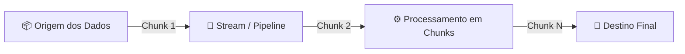

# 🌊 Guia Completo de Streams no Node.js

Este diretório contém os exemplos práticos e a base conceitual de como manipular dados em fluxo contínuo (**Streams**) no Node.js utilizando apenas os módulos nativos `node:stream` e `node:http`.

---

## 📌 1. O que são Streams?

Streams são coleções de dados — assim como arrays ou strings — com uma diferença crucial: **os dados não precisam estar todos disponíveis de uma só vez na memória**.

Em vez de carregar um arquivo ou requisição de 1GB inteiro na memória RAM antes de processar, as Streams permitem que você leia, processe e envie os dados **pedaço por pedaço (chunks/buffers)** em tempo real.



### 💡 Vantagens Principais:
1. **Eficiência de Memória**: O consumo de RAM permanece baixo e constante, independente do tamanho do arquivo (10MB ou 100GB).
2. **Eficiência de Tempo / Latência**: O processamento começa imediatamente assim que o primeiro *chunk* chega, sem esperar o término do download completo.

---

## 🧩 2. Os 4 Tipos de Streams no Node.js

```
┌─────────────────────────────────────────────────────────────┐
│                       TIPOS DE STREAMS                      │
├───────────────┬─────────────────────────────┬───────────────┤
│ Tipo          │ Descrição                   │ Exemplo Real  │
├───────────────┼─────────────────────────────┼───────────────┤
│ Readable      │ Apenas leitura de dados     │ fs.createRead │
│ Writable      │ Apenas envio/escrita        │ fs.createWrite│
│ Transform     │ Lê, transforma e encaminha  │ zlib.createGz │
│ Duplex        │ Lê e escreve independentes  │ net.Socket    │
└───────────────┴─────────────────────────────┴───────────────┘
```

---

### 1️⃣ Readable Stream (Stream de Leitura)
Produz dados que podem ser consumidos por outras streams.
- **Implementação**: Estende `Readable` e sobrescreve o método `_read()`.
- **Envio de dados**: Usa `this.push(Buffer.from(...))`.
- **Fim da stream**: Envia `this.push(null)`.

```javascript
import { Readable } from 'node:stream'

class OneToHundredStream extends Readable {
  index = 1

  _read() {
    const i = this.index++

    setTimeout(() => {
      if (i > 100) {
        this.push(null) // Encerra a stream
      } else {
        const buf = Buffer.from(String(i))
        this.push(buf) // Envia o próximo pedaço
      }
    }, 100)
  }
}
```

---

### 2️⃣ Writable Stream (Stream de Escrita)
Recebe dados de uma fonte e processa/salva no destino final.
- **Implementação**: Estende `Writable` e sobrescreve o método `_write(chunk, encoding, callback)`.
- **Finalização do chunk**: Executa `callback()` para avisar que o processamento do pedaço atual terminou.

```javascript
import { Writable } from 'node:stream'

class MultiplyByTenStream extends Writable {
  _write(chunk, encoding, callback) {
    console.log(Number(chunk.toString()) * 10)
    callback() // Libera para receber o próximo chunk
  }
}
```

---

### 3️⃣ Transform Stream (Stream de Transformação)
Uma stream especial que conecta uma ponta de leitura a uma ponta de escrita, modificando os dados no meio do caminho.
- **Implementação**: Estende `Transform` e sobrescreve o método `_transform(chunk, encoding, callback)`.
- **Encaminhamento**: Executa `callback(null, Buffer.from(novoDado))`.

```javascript
import { Transform } from 'node:stream'

class InverseNumberStream extends Transform {
  _transform(chunk, encoding, callback) {
    const transformed = Number(chunk.toString()) * -1
    callback(null, Buffer.from(String(transformed)))
  }
}
```

---

### 4️⃣ Duplex Stream
Possui canais de leitura e escrita independentes (como um socket de rede TCP ou WebSocket).

---

## 🔗 3. O Método `.pipe()` (Encadeamento)

O `.pipe()` conecta a saída de uma stream diretamente na entrada de outra:

```javascript
new OneToHundredStream()        // 1. Produz: 1, 2, 3...
  .pipe(new InverseNumberStream()) // 2. Transforma: -1, -2, -3...
  .pipe(new MultiplyByTenStream()) // 3. Escreve: -10, -20, -30...
```

---

## 🌐 4. Streams no Módulo HTTP (`node:http`)

No Node.js, as requisições e respostas HTTP são nativamente Streams:

* `req` (Request) $\rightarrow$ É uma **ReadableStream** (você lê os dados que o cliente enviou no corpo da requisição aos poucos).
* `res` (Response) $\rightarrow$ É uma **WritableStream** (você escreve a resposta enviada ao cliente aos poucos).

### Servidor HTTP com Stream (`stream-http-server.js`):
```javascript
import http from 'node:http'
import { Transform } from 'node:stream'

class InverseNumberStream extends Transform {
  _transform(chunk, encoding, callback) {
    const transformed = Number(chunk.toString()) * -1
    console.log(transformed)
    callback(null, Buffer.from(String(transformed)))
  }
}

const server = http.createServer((req, res) => {
  // Conecta o fluxo da requisição diretamente à resposta via transformação:
  return req
    .pipe(new InverseNumberStream())
    .pipe(res)
})

server.listen(3334)
```

---

## 🚀 5. Consumo de Streams via `fetch` no Node.js

Ao enviar uma stream no corpo de uma requisição com o `fetch` nativo no Node.js moderno (v18.15+, v20+, v24+), é **obrigatório** declarar a flag `duplex: 'half'`:

```javascript
import { Readable } from 'node:stream'

// Cliente enviando upload em Stream (fake-upload-to-http-Stream.js)
const response = await fetch('http://localhost:3334', {
  method: 'POST',
  body: new OneToHundredStream(),
  duplex: 'half' // Exigido pela especificação Fetch do Node.js
})

const data = await response.text()
console.log(data)
```

> ⚠️ **Por que `duplex: 'half'` é necessário?**  
> Na especificação oficial WHATWG Fetch implementada no Node.js, requisições HTTP/1.1 que transmitem streams no `body` precisam declarar explicitamente o modo `half` para sinalizar que o upload do corpo será concluído antes da leitura completa da resposta.

---

## 📁 Arquivos deste Módulo

| Arquivo | Descrição |
| :--- | :--- |
| [`fundamentos.js`](file:///c:/Users/richd/Projetos/Rocketseat/aulas-node/01-fundamentos-nodejs/streams/fundamentos.js) | Exemplos de Readable, Writable e Transform conectados via `.pipe()`. |
| [`stream-http-server.js`](file:///c:/Users/richd/Projetos/Rocketseat/aulas-node/01-fundamentos-nodejs/streams/stream-http-server.js) | Servidor HTTP que recebe uma stream na requisição (`req`) e devolve uma stream na resposta (`res`). |
| [`fake-upload-to-http-Stream.js`](file:///c:/Users/richd/Projetos/Rocketseat/aulas-node/01-fundamentos-nodejs/streams/fake-upload-to-http-Stream.js) | Script simulando envio de dados em fluxo para o servidor HTTP usando `fetch` e `duplex: 'half'`. |
