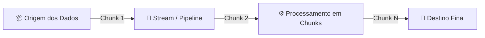

# 🌊 Guia Completo de Streams no Node.js

Este documento contém os conceitos, arquitetura e exemplos práticos de manipulação de dados em fluxo contínuo (**Streams**) no Node.js utilizando apenas os módulos nativos `node:stream` e `node:http`.

---

## 📌 1. O que são Streams?

Streams são estruturas para manipulação de coleções de dados de forma assíncrona e em partes. A principal vantagem é que **os dados não precisam estar completamente disponíveis na memória RAM de uma única vez para serem processados**.

Em vez de carregar um arquivo ou payload de 1GB por inteiro na memória, as Streams permitem ler, processar e enviar os dados **pedaço por pedaço (chunks / buffers)** em tempo real.



### 💡 Vantagens Principais:
1. **Eficiência de Memória (RAM)**: O consumo de memória permanece baixo e constante, independentemente de estarmos lidando com 10MB ou 100GB.
2. **Eficiência de Tempo / Menor Latência**: O processamento começa imediatamente assim que o primeiro *chunk* de dados é recebido, sem a necessidade de esperar o upload/download completo terminar.

---

## 🧩 2. Os 4 Tipos Fundamentais de Streams no Node.js

```
┌─────────────────────────────────────────────────────────────┐
│                       TIPOS DE STREAMS                      │
├───────────────┬─────────────────────────────┬───────────────┤
│ Tipo          │ Descrição                   │ Exemplo Real  │
├───────────────┼─────────────────────────────┼───────────────┤
│ Readable      │ Apenas leitura de dados     │ fs.createRead │
│ Writable      │ Apenas envio/escrita        │ fs.createWrite│
│ Transform     │ Lê, transforma e encaminha  │ zlib.createGz │
│ Duplex        │ Lê e escreve independentes  │ net.Socket    │
└───────────────┴─────────────────────────────┴───────────────┘
```

---

### 1️⃣ Readable Stream (Stream de Leitura)
Responsável por produzir dados que podem ser consumidos por outras streams.
- **Implementação**: Estende a classe `Readable` e implementa o método obrigatório `_read()`.
- **Envio de dados**: Utiliza `this.push(Buffer.from(...))`.
- **Fim da stream**: Envia `this.push(null)` para indicar que não há mais dados.

```javascript
import { Readable } from 'node:stream'

class OneToHundredStream extends Readable {
  index = 1

  _read() {
    const i = this.index++

    setTimeout(() => {
      if (i > 100) {
        this.push(null) // Encerra a stream
      } else {
        const buf = Buffer.from(String(i))
        this.push(buf) // Envia o chunk para leitura
      }
    }, 100)
  }
}
```

---

### 2️⃣ Writable Stream (Stream de Escrita)
Recebe dados enviados por uma fonte e realiza a escrita, gravação ou processamento final.
- **Implementação**: Estende a classe `Writable` e implementa o método `_write(chunk, encoding, callback)`.
- **Finalização do chunk**: Executa a função `callback()` quando termina de processar o pedaço recebido, liberando a stream para receber o próximo.

```javascript
import { Writable } from 'node:stream'

class MultiplyByTenStream extends Writable {
  _write(chunk, encoding, callback) {
    console.log(Number(chunk.toString()) * 10)
    callback() // Libera para o próximo chunk
  }
}
```

---

### 3️⃣ Transform Stream (Stream de Transformação)
Uma stream intermediária que lê dados de uma entrada, aplica uma transformação nesses dados e os disponibiliza para a saída.
- **Implementação**: Estende a classe `Transform` e implementa `_transform(chunk, encoding, callback)`.
- **Encaminhamento dos dados**: Executa `callback(null, Buffer.from(dadoTransformado))`.

```javascript
import { Transform } from 'node:stream'

class InverseNumberStream extends Transform {
  _transform(chunk, encoding, callback) {
    const transformed = Number(chunk.toString()) * -1
    callback(null, Buffer.from(String(transformed)))
  }
}
```

---

### 4️⃣ Duplex Stream
Possui canais de leitura e escrita totalmente independentes (exemplo: `net.Socket` no TCP).

---

## 🔗 3. O Método `.pipe()` (Encadeamento / Pipeline)

O método `.pipe()` conecta a saída (*output*) de uma stream diretamente na entrada (*input*) de outra:

```javascript
new OneToHundredStream()           // 1. Produz dados (Readable)
  .pipe(new InverseNumberStream()) // 2. Transforma dados (Transform)
  .pipe(new MultiplyByTenStream()) // 3. Processa dados (Writable)
```

---

## 🌐 4. Streams no Módulo HTTP (`node:http`)

Dentro do Node.js, todas as requisições e respostas HTTP são nativamente Streams:

* **`req` (IncomingMessage)** $\rightarrow$ É uma **ReadableStream**. Os dados enviados no corpo da requisição são recebidos em partes (*chunks*).
* **`res` (ServerResponse)** $\rightarrow$ É uma **WritableStream**. Os dados de resposta são enviados ao cliente em fluxo até o método `res.end()` ou até o término do *pipe*.

### Servidor HTTP com Stream (`stream-http-server.js`):
```javascript
import http from 'node:http'
import { Transform } from 'node:stream'

class InverseNumberStream extends Transform {
  _transform(chunk, encoding, callback) {
    const transformed = Number(chunk.toString()) * -1
    console.log(transformed)
    callback(null, Buffer.from(String(transformed)))
  }
}

const server = http.createServer((req, res) => {
  // Conecta o fluxo da requisição à transformação e direciona à resposta:
  return req
    .pipe(new InverseNumberStream())
    .pipe(res)
})

server.listen(3334)
```

---

## 🚀 5. Envio de Streams via `fetch` no Node.js

Ao enviar uma stream no corpo de uma requisição com o `fetch` nativo no Node.js moderno (v18.15+, v20+, v24+), é **obrigatório** declarar a flag `duplex: 'half'`:

```javascript
import { Readable } from 'node:stream'

// fake-upload-to-http-Stream.js
const response = await fetch('http://localhost:3334', {
  method: 'POST',
  body: new OneToHundredStream(),
  duplex: 'half' // Obrigatório nas versões modernas do Node.js
})

const data = await response.text()
console.log(data)
```

> ⚠️ **Por que `duplex: 'half'` é necessário?**  
> Na especificação WHATWG Fetch adotada pelo Node.js, requisições HTTP que transmitem streams no `body` exigem `duplex: 'half'` para estabelecer que todo o corpo da requisição será transmitido antes de consumir a resposta completa.

---

## 📁 Arquivos deste Diretório

| Arquivo | Finalidade |
| :--- | :--- |
| [`fundamentos.js`](file:///c:/Users/richd/Projetos/Rocketseat/aulas-node/01-fundamentos-nodejs/streams/fundamentos.js) | Exemplos de Readable, Writable e Transform conectados via `.pipe()`. |
| [`stream-http-server.js`](file:///c:/Users/richd/Projetos/Rocketseat/aulas-node/01-fundamentos-nodejs/streams/stream-http-server.js) | Servidor HTTP recebendo stream na requisição (`req`) e devolvendo stream na resposta (`res`). |
| [`fake-upload-to-http-Stream.js`](file:///c:/Users/richd/Projetos/Rocketseat/aulas-node/01-fundamentos-nodejs/streams/fake-upload-to-http-Stream.js) | Cliente simulando envio de dados em fluxo contínuo via `fetch` com `duplex: 'half'`. |
